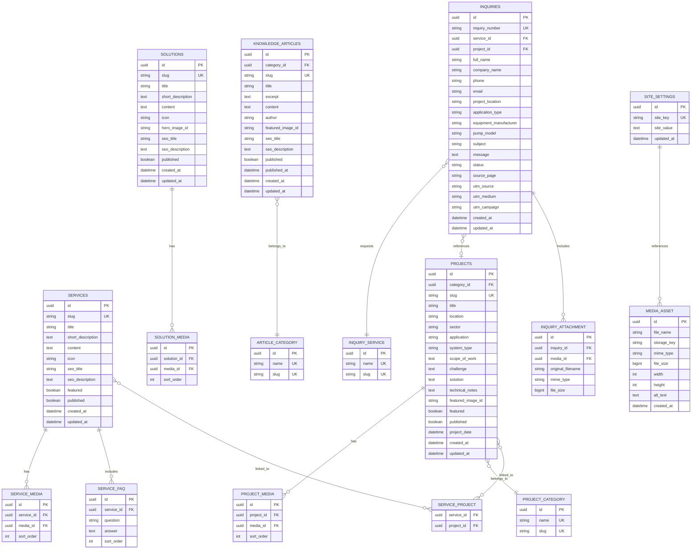

# ZAD Electromechanical Services
## Website Product Requirements Document (PRD) + ERD
### English-Only Corporate Website
### Version 1.0

---

## 1. Document Purpose

This document defines the complete product, UX, content, functional, technical, SEO, data-model and acceptance requirements for the new ZAD Electromechanical Services website.

The website must transform the current ZAD website into a premium, modern, engineering-focused corporate website while **preserving the existing visual identity and overall design language of the current website**.

### Source of truth
The primary factual source is the attached ZAD company profile. The profile presents ZAD as an electromechanical services company established in 2020 as a subsidiary of Kayan for Import, focused on pump products/services, localization and technical support. It references more than 170 projects, local pump assembly, commissioning, maintenance, diagnostics, spare parts and multiple pump-system service categories.

### Explicit content restriction
The website is **English only**.

The following must be completely removed from the website content, metadata, schema, images/captions, code strings, navigation, CMS seed data and generated copy:

- Wilo
- Any Wilo logo or brand reference
- Authorized Service Provider
- Authorized Service Partner
- Any equivalent statement implying authorization, certification or official representation for a third-party brand

Do not replace those references with another unsupported manufacturer/authorization claim.

---

# 2. Product Vision

## Vision

Create a high-end digital presence that positions ZAD as a specialized engineering and electromechanical company that supports the pump-system lifecycle from local assembly and commissioning through maintenance, diagnostics, repairs, spare parts and technical support.

## Core positioning

> **ENGINEERED FOR PERFORMANCE. BUILT FOR RELIABILITY.**

Secondary brand line:

> **OUR CHALLENGE IS YOUR SATISFACTION**

## Core business pillars

1. Local Pump Assembly
2. Pump Engineering & Commissioning
3. Maintenance & Repair
4. Technical Diagnostics
5. Pump System Solutions
6. Genuine Spare Parts
7. Responsive Technical Support

---

# 3. Business Objectives

### BO-01 — Establish credibility
Present ZAD as an engineering-led company rather than a generic pump seller.

### BO-02 — Generate qualified leads
Convert visitors into service requests, quotation requests and technical inquiries.

### BO-03 — Explain capabilities
Make services and system types easy to understand for technical and non-technical buyers.

### BO-04 — Showcase experience
Use the documented **170+ projects** figure and real project content where available.

### BO-05 — Highlight localization
Make local assembly a major differentiator.

### BO-06 — Demonstrate technical depth
Show diagnostic tools, engineering processes and maintenance methodology.

### BO-07 — Create scalable content
Use a CMS-ready architecture for services, solutions, projects and knowledge articles.

---

# 4. Target Audiences

## Primary

- Facility managers
- MEP contractors
- Mechanical contractors
- Procurement managers
- Maintenance managers
- Industrial companies
- Building owners/operators
- HVAC contractors
- Water-system operators
- Engineering consultants
- Project managers

## Secondary

- Residential building management
- Commercial facilities
- Industrial facilities
- Property management companies
- Technical buyers seeking spare parts or repair support

---

# 5. Brand and Design Direction

The current site and supplied profile establish a recognizable visual language that must be retained rather than replaced.

## Visual DNA

- Deep ZAD blue
- Strong yellow accent
- White content areas
- Industrial gray
- Large industrial imagery
- Heavy mechanical equipment
- Strong condensed/technical-feeling headings
- Geometric spacing
- Technical lines and separators
- High contrast
- Engineering-oriented visual storytelling

## Design instruction

The redesign should feel like an **evolution of the existing ZAD website**, not a completely unrelated redesign.

Preserve where practical:

- Existing logo treatment
- Existing color relationship
- Existing visual hierarchy
- Existing section rhythm
- Existing industrial photography style
- Existing yellow accent treatment
- Existing typography character

Improve:

- Information architecture
- Content depth
- Conversion paths
- Mobile UX
- Accessibility
- SEO
- Page consistency
- CMS readiness
- Lead-generation forms
- Technical storytelling

---

# 6. Global Website Requirements

## Language

English only.

Do not create Arabic routes, language selectors, RTL logic or bilingual database fields.

## Responsive breakpoints

Recommended:

- Mobile: < 768px
- Tablet: 768px–1199px
- Desktop: 1200px+

## Global CTAs

Primary:

- Request a Service
- Contact ZAD

Secondary:

- Explore Services
- View Projects
- Request Spare Parts

Emergency:

- 24/7 Technical Support

## Header

Desktop navigation:

- Home
- About
- Services
- Solutions
- Local Assembly
- Projects
- Technology
- Support
- Contact

Primary header CTA:

> Request a Service

## Mobile sticky CTA

- Call
- Request Service

Only add WhatsApp after the actual official WhatsApp number is confirmed by ZAD.

---

# 7. Site Map

```text
/
├── /about
├── /services
│   ├── /services/commissioning
│   ├── /services/maintenance-repair
│   ├── /services/inspection
│   ├── /services/emergency-support
│   └── /services/spare-parts
├── /solutions
│   ├── /solutions/booster-sets
│   ├── /solutions/chiller-pumps
│   ├── /solutions/submersible-pumps
│   └── /solutions/pump-systems
├── /local-assembly
├── /projects
│   └── /projects/[slug]
├── /technology
├── /support
├── /request-service
├── /contact
├── /knowledge
│   └── /knowledge/[slug]
├── /privacy-policy
└── /terms
```

---

# 8. Page-by-Page Product Specification

# 8.1 HOME PAGE

## Route

`/`

## SEO title

**ZAD Electromechanical Services | Pump Engineering & Services in Egypt**

## Meta description

> ZAD provides specialized pump engineering, local assembly, commissioning, maintenance, diagnostics, repairs, spare parts and technical support in Egypt.

## Hero

### Eyebrow

**ZAD ELECTROMECHANICAL SERVICES**

### H1

**ENGINEERED FOR PERFORMANCE.**

**BUILT FOR RELIABILITY.**

### Body

> From local pump assembly and commissioning to preventive maintenance, emergency repairs and genuine spare-parts support, ZAD provides specialized electromechanical services focused on dependable system performance.

### CTAs

- Explore Our Services
- Request a Service

### Supporting CTA

- 24/7 Technical Support

### Visual direction

Use the strongest available actual ZAD pump image from the existing website/project files. Prefer a large industrial pump installation with visible mechanical detail and strong negative space for copy.

### Animation

- Headline line reveal
- Image subtle scale-in
- Yellow accent line draw
- CTA hover arrow animation

---

## Home Section: Experience Metrics

### 170+

**PROJECTS**

### 2020

**ESTABLISHED**

### 24/7

**TECHNICAL SUPPORT**

Only publish metrics that are confirmed by the source material or subsequently approved by ZAD.

Animation: count-up on viewport entry.

---

## Home Section: About

### Eyebrow

**ABOUT ZAD**

### H2

**Engineering Expertise Built Around Your System**

### Copy

> Established in 2020 as a subsidiary of Kayan for Import, ZAD Electromechanical Services was created to respond to the growing need for professional pump products and technical services with stronger local capabilities and shorter delivery times.
>
> ZAD combines pump assembly, commissioning, inspection, maintenance, repair and technical support to help customers keep their systems operating reliably.

### CTA

**Discover ZAD**

### Visual

Use an actual ZAD facility/pump/assembly image.

---

## Home Section: Services

### H2

**Complete Pump & Electromechanical Services**

### Intro

> From installation and commissioning to maintenance and spare-parts support, our services are structured around the complete lifecycle of pump systems.

### Cards

#### Commissioning & Start-Up
> Professional commissioning and start-up support to help ensure pump systems are installed, checked and prepared for reliable operation.

#### Maintenance & Repair
> Preventive and corrective maintenance designed to address equipment issues, minimize downtime and maintain system performance.

#### Pump Inspection
> Technical inspection to identify potential mechanical and operational issues before they develop into larger failures.

#### Local Pump Assembly
> Local assembly capabilities that support shorter lead times, reduced logistical complexity and greater flexibility for project requirements.

#### Genuine Spare Parts
> Genuine spare-parts support backed by technical guidance to help reduce replacement delays and equipment downtime.

#### Emergency Support
> Responsive technical support for unexpected pump and system failures.

CTA: **View All Services**

---

## Home Section: Local Assembly

### Eyebrow

**LOCALIZATION**

### H2

**Local Assembly. Faster Delivery. Greater Flexibility.**

### Copy

> Local assembly brings pump capability closer to the customer.
>
> By assembling and configuring pump systems locally, ZAD can support shorter delivery times while creating greater flexibility around application requirements.

### Benefits

- Shorter Lead Times
- Reduced Logistics
- Flexible Configuration

### Process animation

Requirement → Configuration → Assembly → Inspection → Delivery

CTA: **Explore Local Assembly**

---

## Home Section: Solutions

### H2

**Pump Systems We Support**

### Booster Sets

> Technical services for booster systems covering fault finding, repair, new installation, upgrades, inverter installation and mechanical-seal replacement.

### Chiller Pump Systems

> Services covering fault finding, installation, commissioning, energy-focused assessment, control-panel replacement and system upgrades.

### Submersible Pump Systems

> Technical support for submersible pump applications, including inspection, troubleshooting, maintenance and system-related support.

### Pump Assembly

> Local assembly and configuration of pump systems according to application requirements.

---

## Home Section: Why ZAD

### H2

**Why ZAD**

Six value blocks:

1. Local Expertise
2. Technical Precision
3. Faster Response
4. Lifecycle Support
5. Genuine Parts
6. 24/7 Support

Avoid unverified quantitative claims.

---

## Home Section: Technology

### H2

**Precision Engineering Powered by Advanced Tools**

### Intro

> Accurate diagnostics help engineers move from assumptions to measurable technical information.

### Tools

- Laser Alignment
- Infrared Temperature Measurement
- Tachometer

Use real images where available.

---

## Home Section: Reliability

### H2

**Protect Performance Before Failure Happens**

### Copy

> Pump failure can disrupt operations, increase costs and create unnecessary emergency intervention.
>
> ZAD approaches maintenance with a focus on inspection, diagnostics, preventive action and professional repair.

### Visual flow

**INSPECT → DIAGNOSE → RESTORE**

---

## Home Section: Projects

### H2

**170+ Projects Across Egypt**

### Copy

> Our growing project portfolio reflects ZAD's involvement in pump systems, localized assembly and electromechanical service activities across Egypt.

### Interactive map

Use the locations visually represented in the profile where appropriate:

- Alexandria
- Port Said
- Cairo
- Giza
- Aswan

Do not invent regional project counts.

CTA: **Explore Projects**

---

## Home Section: Industries

### H2

**Supporting Critical Applications**

Cards:

- Residential Buildings
- Commercial Facilities
- Industrial Applications
- HVAC & Chilled Water
- Water Supply & Pressure Boosting
- Water Management

---

## Home Section: Emergency

### H2

**Unexpected Failure Can't Wait.**

### Body

> When a critical pump system stops, every minute matters. ZAD provides responsive technical support for urgent pump and electromechanical service requirements.

CTA: **Request Emergency Support**

---

## Home Section: Final CTA

### H2

**Need Help With Your Pump System?**

### Body

> Tell us about your equipment, project or service requirement.

Buttons:

- Request a Service
- Contact ZAD

---

# 8.2 ABOUT PAGE

## H1

**Engineering Built Around Reliability**

### Intro

> ZAD combines local capabilities, technical expertise and responsive service to support pump systems throughout their operating lifecycle.

Sections:

- Our Story
- Our Mission
- Our Vision
- Our Approach
- Core Capabilities

### Mission

> To provide reliable and professionally delivered pump and electromechanical services that help customers maintain system performance and operational continuity.

### Vision

> To build a stronger local engineering and service capability for pump systems in Egypt.

---

# 8.3 SERVICES PAGE

## H1

**Complete Pump Services. One Engineering Partner.**

Services:

1. Commissioning & Start-Up
2. Maintenance & Repair
3. Pump Inspection
4. Local Assembly
5. Booster Set Services
6. Chiller Pump Services
7. Submersible Pump Services
8. Emergency Support
9. Genuine Spare Parts

Each service detail page should include:

- Hero
- Overview
- Service activities
- Applications
- Benefits
- FAQ
- CTA

---

# 8.4 SOLUTIONS PAGE

## H1

**Pump Systems We Support**

Solution pages:

- Booster Sets
- Chiller Pumps
- Submersible Pumps
- Pump Systems

Each solution page should explain the application, typical service scope, diagnostic approach and CTA.

---

# 8.5 LOCAL ASSEMBLY PAGE

## H1

**Local Assembly. Built Around Your Requirements.**

Sections:

- Why Local Assembly?
- How It Works
- Benefits
- Pump Categories
- Inspection and Quality Checks
- Request Service

Process:

Requirement → Configuration → Assembly → Inspection → Delivery

Pump categories mentioned in source material may include:

- Split Case Pumps
- End Suction Pumps
- Booster Sets

Only publish a category if the final ZAD content owner approves it.

---

# 8.6 PROJECTS PAGE

## H1

**More Than 170 Projects. One Commitment to Service.**

Filters:

- All
- Booster Systems
- Pump Assembly
- Maintenance
- Commissioning
- Chiller Systems
- Submersible Systems

Project detail template:

- Project name
- Location
- Application
- System
- Scope of Work
- Challenge
- ZAD Approach
- Gallery
- Technical Notes

Never invent project results.

---

# 8.7 TECHNOLOGY PAGE

## H1

**Technology That Helps Us Find the Problem**

Tools:

### Laser Alignment
> Shaft misalignment can contribute to premature machinery failure. ZAD uses laser alignment technology to support accurate shaft alignment and reduce avoidable mechanical problems.

### Infrared Temperature Measurement
> Temperature measurement helps identify abnormal thermal conditions and supports early investigation of potential equipment issues.

### Tachometer
> Rotational-speed measurement helps verify that equipment is operating within its expected operating range.

---

# 8.8 SPARE PARTS PAGE

## H1

**The Right Part. The Right Support.**

### Copy

> ZAD supports customers with genuine spare-parts supply and technical guidance to help identify the correct component and reduce equipment downtime.

Sections:

- Genuine Parts
- Technical Identification
- Application Support
- Request Spare Parts

---

# 8.9 SUPPORT PAGE

## H1

**Support Beyond Installation**

Sections:

- Emergency Support
- Periodic Maintenance
- Technical Inspection
- Maintenance Documentation
- Spare Parts

---

# 8.10 REQUEST SERVICE PAGE

## H1

**Tell Us What Your System Needs**

Form fields:

- Full Name
- Company Name
- Phone
- Email
- Project Location
- Application Type
- Equipment Manufacturer
- Pump Model
- Service Required
- Message
- Pump Photo
- Equipment Plate Photo
- Technical Documents

Service values:

- Commissioning
- Maintenance
- Emergency Repair
- Pump Inspection
- Booster Set
- Chiller Pumps
- Submersible Pumps
- Local Assembly
- Spare Parts
- Technical Consultation
- Other

Success message:

> Thank you. Your request has been received and our team will review the information provided.

---

# 8.11 CONTACT PAGE

## H1

**Let's Keep Your System Running**

Contact information from the supplied profile:

**Address**
Unit No. A14
Polaris Al-Zamil Industrial
6th of October City, Egypt

**Phone**
+20 2 3865 4079

**Email**
support@zad-eg.net

Use a map centered on the confirmed business location only if the exact location is verified.

---

# 8.12 KNOWLEDGE CENTER

## H1

**Engineering Knowledge for Better Decisions**

Suggested initial article titles:

1. What Is Pump Commissioning?
2. Why Shaft Alignment Matters
3. Common Causes of Pump Failure
4. Preventive vs Corrective Maintenance
5. When Does a Pump Need Inspection?
6. Understanding Booster Pump Systems
7. How to Identify the Correct Spare Part
8. Why Local Pump Assembly Matters

Do not make unsupported ZAD-specific claims in educational articles.

---

# 9. Functional Requirements

## FR-01 Navigation

Global navigation must work across all pages.

## FR-02 Search

Knowledge Center search must support article-title and keyword search.

## FR-03 Service filtering

Projects must support client-side or server-side filtering.

## FR-04 Project details

Each project must have a dedicated SEO-friendly detail route.

## FR-05 Forms

Request Service, Contact and Spare Parts inquiries must submit securely.

## FR-06 Uploads

Support images and PDF documents with server-side type and size validation.

## FR-07 Lead notification

Notify configured ZAD recipient(s) by email when a request is submitted.

## FR-08 Lead storage

Store submissions in the application database.

## FR-09 Spam protection

Use server-side rate limiting and a modern anti-spam mechanism.

## FR-10 Analytics

Track conversion events.

## FR-11 CMS

Services, projects and knowledge articles must be editable without code changes if the current stack supports a CMS/admin layer.

## FR-12 SEO

Generate page metadata, canonical tags and sitemap automatically.

---

# 10. Content Management Requirements

Entities:

- Service
- Solution
- Project
- Tool
- Knowledge Article
- Inquiry
- Site Setting
- Media Asset

Every editable content entity should support:

- title
- slug
- body
- featured image
- SEO title
- SEO description
- status
- publish date
- sort order

English only.

---

# 11. ERD

## Mermaid ERD



---

# 12. ERD Design Notes

## Service / Project relationship

A service can be demonstrated by multiple projects and a project can cover multiple services, so this is many-to-many.

## Media abstraction

Use a shared `MEDIA_ASSET` table so images/documents can be reused across services, projects and articles.

## Inquiry tracking

Store the page source and campaign parameters to support marketing attribution.

## Inquiry numbers

Recommended format:

`ZAD-REQ-2026-00001`

The exact numbering rule can be changed in implementation.

## Status values

Recommended:

- New
- In Review
- Contacted
- Quoted
- In Progress
- Closed
- Spam

---

# 13. SEO Requirements

Every indexable page must have:

- unique title
- unique meta description
- canonical URL
- H1
- logical H2/H3 hierarchy
- descriptive image alt text
- Open Graph metadata
- social sharing image
- structured data where appropriate
- sitemap inclusion

Recommended schema types:

- Organization
- WebSite
- WebPage
- Service
- Article
- BreadcrumbList

Do not generate unsupported certifications or manufacturer relationships in schema.

---

# 14. Analytics

Track:

- hero_cta_click
- service_view
- service_cta_click
- request_service_start
- request_service_submit
- contact_form_submit
- phone_click
- project_view
- spare_parts_request
- article_view
- article_search
- file_upload

Capture:

- page path
- referrer
- source
- medium
- campaign
- device category
- timestamp

---

# 15. Accessibility

Target WCAG 2.1 AA practices.

Requirements:

- semantic HTML
- visible keyboard focus
- descriptive labels
- image alt text
- accessible form errors
- sufficient color contrast
- reduced-motion support
- no information conveyed by color alone
- logical heading order

---

# 16. Performance

Target:

- Lighthouse Performance >= 90
- Lighthouse Accessibility >= 95
- Lighthouse Best Practices >= 95
- Lighthouse SEO >= 95

Implement:

- AVIF/WebP
- responsive image sizing
- lazy loading
- critical CSS strategy appropriate to the current stack
- deferred non-critical scripts
- optimized fonts
- minimal third-party JavaScript
- hero image optimization

---

# 17. Security

- HTTPS
- server-side validation
- CSRF protection where applicable
- secure file upload handling
- MIME validation
- file extension validation
- size limits
- rate limiting
- spam protection
- sanitized content
- secure HTTP headers
- no secrets in frontend code

---

# 18. Content Safety and Governance

Never invent:

- customer/client names
- certifications
- awards
- project values
- project results
- technical specifications
- guaranteed response times
- employee counts
- revenue
- third-party authorization
- manufacturer partnerships

Use a placeholder such as `[CONTENT REQUIRED FROM ZAD]` until verified.

---

# 19. Acceptance Criteria

The work is complete when:

1. All primary pages exist and are linked.
2. The visual language remains recognizably consistent with the current ZAD site.
3. Wilo and authorization-related content is completely absent.
4. The website is English-only.
5. All major CTAs work.
6. Service and project content is CMS-ready.
7. Request Service form stores and emails inquiries.
8. Upload validation works securely.
9. SEO metadata is implemented.
10. Sitemap and robots.txt exist.
11. Responsive layouts work at mobile, tablet and desktop sizes.
12. Accessibility checks pass at a professional baseline.
13. No lorem ipsum remains.
14. No unsupported claims are presented as facts.
15. Real ZAD assets are reused where available.
16. Existing design identity is retained and refined rather than replaced.

---

# 20. Implementation Priority

## P0 — Must have

- Home
- About
- Services
- Solutions
- Local Assembly
- Projects
- Technology
- Support
- Request Service
- Contact
- Responsive design
- SEO
- Forms
- Security

## P1 — Important

- Knowledge Center
- Advanced project filtering
- CMS/admin
- Analytics dashboard integration
- Rich project detail pages

## P2 — Future

- Customer portal
- Service tracking
- Online spare-parts inquiry workflow
- Maintenance contract request workflow
- Technical document library
- CRM/ERP integration

---

# 21. Final Product Definition

The finished website should communicate, within the first 10 seconds:

> ZAD is an engineering-focused Egyptian company specializing in pump systems, local assembly, commissioning, maintenance, diagnostics, repairs and technical support.

The user should then be able to immediately:

1. Understand what ZAD does.
2. Identify the relevant service.
3. Review technical credibility.
4. See project experience.
5. Submit a service request.

The result must feel like a premium industrial engineering website while remaining faithful to the current ZAD visual identity.
